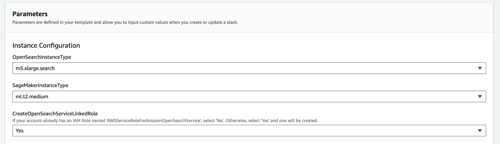
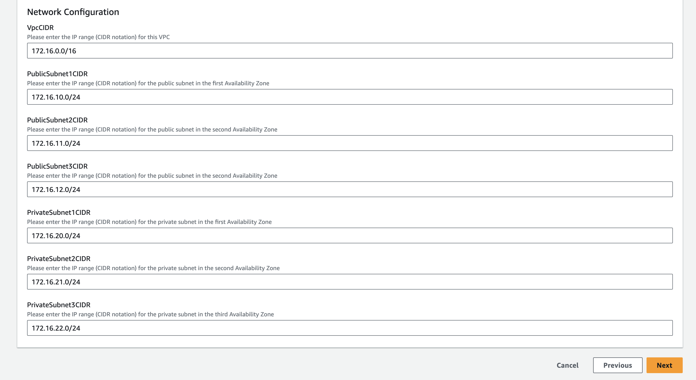
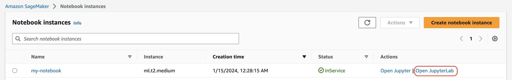

## **Unlocking Personalized Experiences Powered by AI using Amazon Personalize and Amazon OpenSearch**

[OpenSearch](https://opensearch.org/) is a scalable, flexible, and extensible open-source software suite for semantic
search, log analytics, security monitoring, and observability applications, licensed under the Apache 2.0 license.
Amazon OpenSearch Service is a fully managed service that makes it simple to deploy, scale, and operate OpenSearch in
the AWS Cloud.

[Amazon Personalize](https://aws.amazon.com/personalize/) allows you to easily add sophisticated personalization
capabilities to your applications by using the same machine learning (ML) technology used on Amazon.com for over 20
years. No ML expertise is required.

This repo contains code which helps you to deploy Amazon Personalize and Amazon OpenSearch resources and configure
the [Personalized Search Plugin for Amazon Opensearch](https://aws.amazon.com/blogs/machine-learning/personalize-your-search-results-with-amazon-personalize-and-amazon-opensearch-service-integration/).
This allows you to leverage user’s interaction histories and interests in order to enhance the search results.

**Dataset:**

MovieLens + IMDb Dataset

**NOTE:**
> Your use of IMDb data is for the sole purpose of completing the AWS workshop and/or tutorial. Any use of IMDb data
> outside of the AWS workshop and/or tutorial requires a data license from IMDb. To obtain a data license, please contact:
> imdb-licensing-support@imdb.com.

### Goals

Readers will be able to learn to deploy and configure the Personalize Plugin for OpenSearch which will benefit customers
to get personalized search results based on a user. Readers will also be able to learn how the search results vary when
you adjust the personalization weight.

### Process

1. Deploying your working environment [see below]
2. Configure Amazon Personalize - 1.Configure_Amazon_Personalize.ipynb
3. Configure Amazon OpensSearch - 2.Configure_Amazon_OpenSearch.ipynb
4. Test the Personalize Plugin - 3.Testing.ipynb
5. Clean Up - 4.Clean_Up.ipynb

### Deploying Your Working Environment

As mentioned above, the first step is to deploy a CloudFormation template that will perform much of the initial setup
work for you. In another browser window or tab, login to your AWS account. Once you have done that, open the link below
in a new tab to start the process of deploying the items you need via CloudFormation.

The below button deploys the CloudFormation stack in us-east-1 region.

You can also follow along with the screenshots below.

#### CloudFormation CLI

`aws cloudformation deploy --template-file personalized-ranking-opensearch.yaml --stack-name personalized-ranking-opensearch-stack --capabilities CAPABILITY_IAM`

You can use the `--parameter-overrides param-name=<param-value>` to set any parameters if you don't want to use the
default values set in the template.

#### CloudFormation Wizard

- Upload the CloudFormation template  `personalized-ranking-opensearch.yaml` and click Next:

- Give the Stack a relevant name like `personalize-opensearch-ranking` to identify its purpose.

- Choose an OpenSearch instance type. We here select an instance type like the "m5.xlarge.search" which has a "Maximum
   size of HTTP request payloads" of 100MB to support our bulk index file upload.
- Select an instance type for the SageMaker notebook that meets your performance needs.
- You will have to navigate to the [Identity and Access Management(IAM) service Roles page](https://console.aws.amazon.com/iam/home#/roles) and search for the role name `AWSServiceRoleForAmazonOpenSearchService`, if this role exists, select 'No' otherwise select 'Yes'

- Input appropriate CIDR ranges for the VPC and Subnets based on your needs or accept the default values if they work
   for you.

- When you are done click `Next` at the bottom.

- This page is a bit longer, so scroll to the bottom to click Next. All the defaults should be sufficient to complete the POC, if you have custom requirements, alter as necessary.

- Again scroll to the bottom, check the box to enable the template to create new IAM resources and then click `Create Stack`.

- Once it has completed you'll see green text like below indicating that the deployment has completed:

- Now that your environment has been created go to the service page for SageMaker by clicking Services in the top of the console and then searching for SageMaker and clicking the service.

- On this page, on the left hand side menu select `Notebook` > `Notebook instances` where you will see a list of any SageMaker notebooks you have running, click the `Open JupyterLab link` on the my-notebook notebook you have created.

- This will open the Jupyter environment for your configure the resource further; think of it as a web based data science IDE if you are not familiar with it.

#### **How to Use the Notebook**

The code is broken up into cells like the one below. There's a triangular Run button at the top of this page that you
can click to execute each cell and move onto the next, or you can press Shift + Enter while in the cell to execute it
and move onto the next one.

As a cell is executing you'll notice a line to the side showcase an * while the cell is running, or it will update to a
number to indicate the last cell that completed executing after it has finished executing all the code within a cell.

Simply follow the instructions below and execute the cells to get started with Amazon Personalize using case optimized
recommenders.

